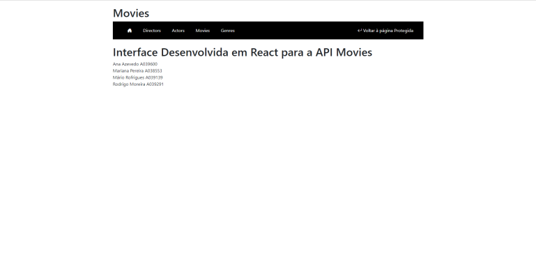
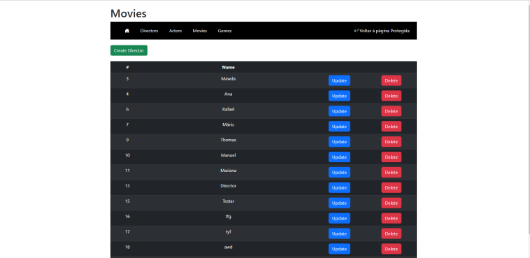
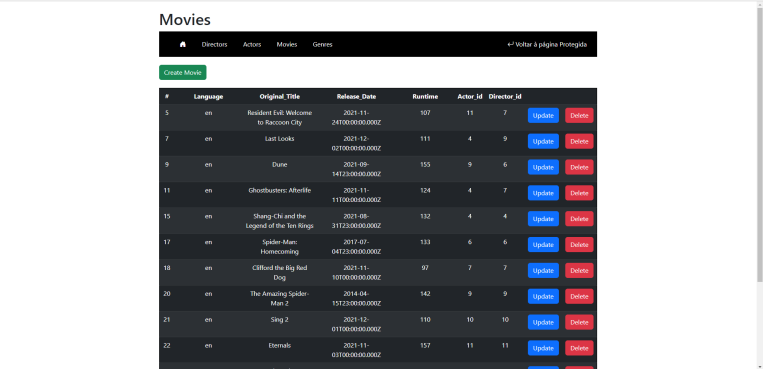
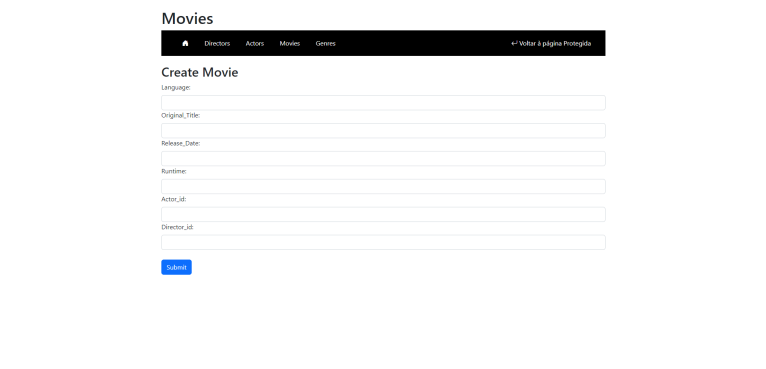
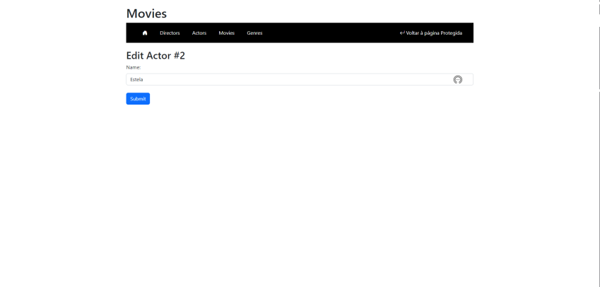

# Parte 2 - Desenvolvimento Web II

Neste repositório está o projeto desenvolvido para a disciplina 'Desenvolvimento Web II', uma disciplina de segundo ano do curso de informática da Universidade da Maia. Desenvolvido pelo Grupo _01_: [@AnaAzevedo](https://github.com/AnaAzevedo2), [@MarianaLopes](https://github.com/marlope02), [@MarioRodrigues](https://github.com/MarioRodrigues2304), [@Rodrigo Moreira](https://github.com/rodmoreira41).

## Tema 

Este trabalho tem como âmbito o desenho e criação de um serviço web que relaciona recursos. Tais recursos como 'Movies', 'Genres', 'Actor' e 'Director'. O recuso 'Movies' será o recurso principal, já que terá um genero, ator e diretor associado.  

## Organização do repositório 

_O repositório está organizado da seguite maneira:_
* **Código Fonte API** está na pasta [API](src/).
* **Código Fonte ReactJS** está na pasta [react](src/).
* **Documentação** está na pasta [doc_P2](src/).
* [Documento MYSQL](src/api/openapi.yaml) para criação da Base de Dados.
* [Documento Docker-compose](Queries_base_de_dados.sql)para puxar as imagens dos repositórios DockerHub e montar a aplicação.

## Galeria 

|            |   |
| ---------------------------- | ----------- |
|            |   |
| ---------------------------- | ----------- |
|            |   |

## Tecnologias 

_As tecnologias usadas neste projeto, foram as seguites:_
* OAuth 2.0
* JavaScript
* NodeJS
* MySQL
* OpenAPI

### Frameworks e Livrarias 

* Docker
* NodeJS
* ReactJS

## Relatório
_Estão adicionados um documento por capítulo_

### Apresentação da API
* Capítulo 1: [Apresentação da API](doc_P2/c1.md)
### Recursos
* Capítulo 2: [Recursos](doc_P2/c2.md)
### Produto
* Capítulo 3: [Resultado Final](doc_P2/c3.md)

 

## Grupo _01_
* Ana Azevedo [@AnaAzevedo](https://github.com/AnaAzevedo2) 
* Mariana Lopes [@MarianaLopes](https://github.com/marlope02) 
* Mário Rodrigues [@MarioRodrigues](https://github.com/MarioRodrigues2304)
* Rodrigo Moreira [@Rodrigo Moreira](https://github.com/rodmoreira41)
